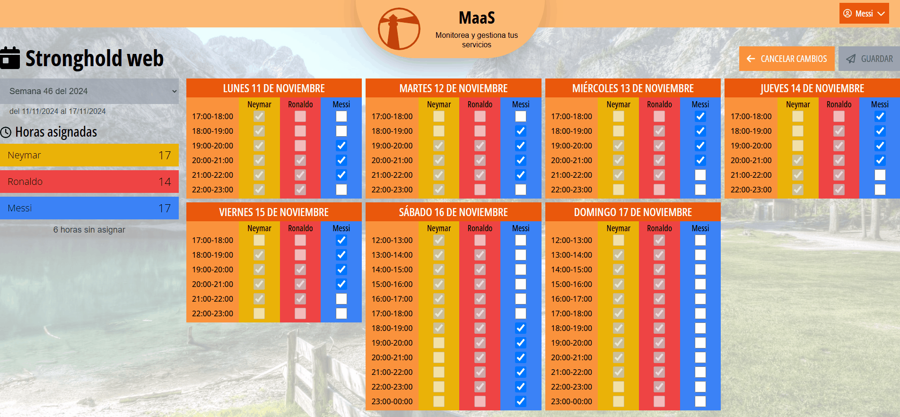

# MaaS (Monitoring as a Service)

Este repositorio contiene una versión dockerizada de la aplicación de monitoreo y gestión de horarios MaaS, brindando una alternativa de fácil instalación.

This repository contains a dockerized version of the MaaS application, providing an alternative for easy installation. Details about the application can be found in the repositories:

<div style="display:flex;flex-direction:row;gap:8px;">
<a href="https://github.com/joseilagosb/maas_frontend"></a>
<a href="https://github.com/joseilagosb/maas_backend"></a>
</div>

## What is MaaS? (Quick Overview)

MaaS is a web application that allows users to monitor and manage their shifts. It provides a platform for employees to view their available hours and schedule their shifts accordingly.

Behind the scenes, the application is powered by a backend API that handles the shift scheduling algorithm, that balances the workload between employees based on their availability.



## Installation

**1.** Create a _.env_ file with the contents of _.env.example_ and fill in the necessary values.

**2.** Build the service images and the database:

```bash
docker-compose build
```

**3.** Before starting the containers, we need to assign the authentication token secret. Run the following command:

```bash
docker-compose run backend bin/rails secret
```

The result of the previous command is a long string that we need to copy and paste in the _.env_ file. The environment variable name should be DEVISE_JWT_SECRET_KEY.

The _.env_ file resulting from the previous operations can be seen in the _.env.final_ file.

**4.** Start the containers

```bash
sudo docker-compose up -d
```

**5.** Create the database and add migrations and seeders with the commands

```bash
docker-compose run backend bin/rails db:create
docker-compose run backend bin/rails db:migrate
docker-compose run backend bin/rails db:seed
```

(it takes a while to run the seeders)

**6.** To access the application, open the browser at http://localhost:4000

## Testing

### Unit tests

```bash
# frontend:
sudo docker-compose run frontend npm run test:unit

# backend:
sudo docker-compose run backend bundle exec guard
# (To quit, run the command 'exit' in guard)
```